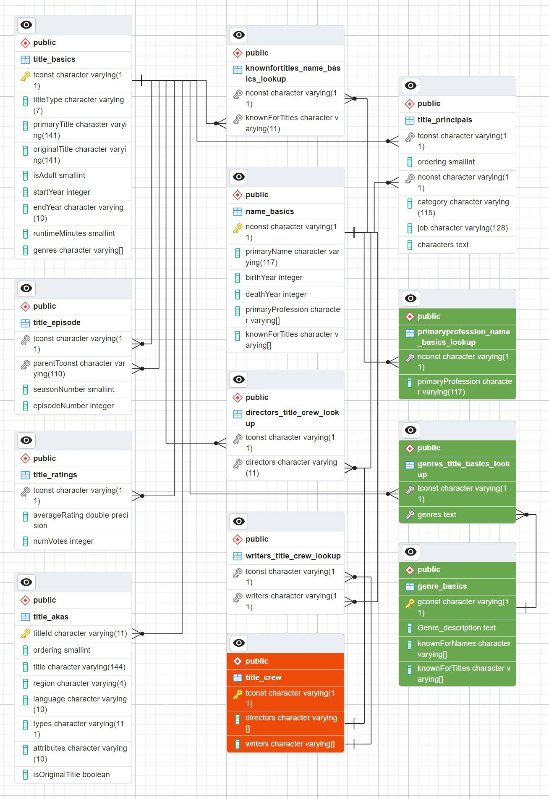

<h1 align="center"><br>
  TSV to Postgres Database
  <br>
</h1>

<h4 align="center">A Python Jupyter Notebook script designed to upload TSV tables to a PostgreSQL database for the IMDb public database, with adaptability for use with other databases.</h4>

<p align="center">
  <a href="#key-features">Key Features</a> •
  <a href="#how-to-use">How To Use</a> •
  <a href="#some-useful-details-about-the-imdb-database">Some useful details about the IMDB database</a> •
  <a href="#erd-of-the-final-imdb-Database">ERD</a> •
  <a href="#files">Files</a>
</p>

<div style="text-align:center">
<video width="640" height="480" controls autoplay>
  <source src="REAT_small_intro.mp4" type="video/mp4">
</video>
<p>Full video link: <a href="https://www.youtube.com/watch?v=BmYtOdtxXIQ">https://www.youtube.com/watch?v=BmYtOdtxXIQ</a></p>
</div>

## Key Features

- Unzipping gzip (gz) files using chunks and temporary files to prevent memory errors.
- Determining column types for the tables.
- Providing an option to alter DataFrame data to the proper list format for the PostgreSQL database when the column type is a list.
- Creating Pandas DataFrames in chunks for efficient memory usage.
- Uploading DataFrames as tables to a PostgreSQL database in chunks.
- Offering an option to alter PostgreSQL table types.
- Running a specific IMDb script that performs useful modifications to the IMDb database, including:
    - Creating lookup tables (if not created during the database upload).
    - Refining column data types.
    - Remove rows from the lookup tables where the corresponding unique identifiers are no longer present in their respective tables.
    - Adding primary and foreign keys to tables.
    - Dropping the title_crew column and moving its contents to the lookup tables.

## How To Use

### Prerequisites

The application requires TSV (Tab-Separated Values) files. If you are using the IMDb public database, please download the files from <a href="https://developer.imdb.com/non-commercial-datasets/">IMDb Non-Commercial Datasets</a> and place them in a folder named "tsv" under the app folder.

Additionally, the application requires the following:
- Python
- Jupyter Notebook
- An Integrated Development Environment (IDE), such as Visual Studio Code (VSC)
- pgAdmin 4 (recommended)

### Main functions

1. #### Initialization
* In the very first cell, it might be necessary to enable progress bars for proper functionality with Jupyter Notebook.
* Please define your desired values for the parameters in this cell.

2. #### Connect or create and connect to the Postgres DB
* Connect to the database or create it if it does not exist.

3. #### Read random lines from the tsv_temp
* Reads random lines from the TSV file and create a sample DataFrame.

4. #### Change the columns with the `list` type to a proper postgres list format
* This step is optional. The `schema.sql` file takes care of this, except for the `list[]` type, such as `title_principals."characters"`. According to IMDb, this column type is considered a string.

5. #### Check datatypes function
    Checks the data types of the DataFrame columns using the following main logic:
* checks if the cell is `\N` or `NaN` alias empty cell and if it is return `None`
* checks if the cell is a `string`,
    - if ',' is in the str it considers as a `list`
    - if the first character is a '-', it checks if it is a negative integer. If it is, it marks it as `integer-` 
    else it checks if it is a positiv integer
    - tries if the str is a `float` if it is returns `floatnr` nr is the total decimals
    - if all above guesses were `False` returns `string`
* checks if the cell is an `integer`
* checks if the cell is a `float` if it is it returns the same as the str float check
* checks if the cell is a `list`
* If all the above checks fail, it tries to convert the cell type to `string` and checks again.
* If all the above attempts fail, it returns `nan`

6. #### df_analysis
    The column names remain the same as in the original DataFrame.
* The first row displays the column data types.
* The second row serves as an indicator of whether the cell lengths are equal or not in the respective column.
* The third row indicates either the length or the maximum length, depending on the context, in the corresponding column.

7. #### Alter table query creator code
    Generates the ALTER TABLE query for PostgreSQL to modify the data types of the uploaded table columns based on the information in the temporary DataFrame (`df_result`).

    Logic:
* `string` if `equal` be `VARCHAR(length+2)` else `VARCHAR(max length + 100)`
* `integer` if less than 4 digits be `SMALLINT` else `INT`
* `list` be `VARCHAR[]`
* `float` with any decimal places be `DOUBLE PRECISION`
* `bool` will be `boolean`
* none of the above be `TEXT`

8. #### Main cell
    Essentially, the main code integrates all the components and functions to execute the entire process.

    Creates and maintains a file named `app_data` to expedite the process by avoiding the recounting of lines in files if it has already been completed. This file stores a dictionary containing file paths and their corresponding previously calculated line numbers.

    In the event of an error, such as 'cannot parse...' or 'df_sample size smaller than random_lines...' attempt to delete this file.

9. #### Run the `schema.sql` (or any other sql) file against the database


### Used python packages:
- pandas
- os
- gzip
- sqlalchemy
- sqlalchemy_utils
- tqdm
- random

## Some useful info about IMDB database

**Database details as of 05-11-2023:**
- name_basic.shape, (12986658, 6)
- title_basics.shape, (10290694, 9)
- title_akas.shape, (37683667, 8)
- title_principals.shape, (58943052, 6)
- title_crew.shape, (10290694, 3)
- title_episode, (7849091, 4)
- title_ratings.shape, (1366302, 3)
<br><br>

In the `title_principals` table, the `nconst` and `tconst` columns contain 10 and 9-character long keys, respectively. This characteristic can lead the algorithm to interpret these columns as VARCHAR(110) (similarly in `title_episode` and `title_ratings` for the `tconst` column).

Check:<br>
```
SELECT MAX("nconst"), LENGTH("nconst") AS character_count
FROM title_principals
GROUP BY character_count
ORDER BY LENGTH("nconst") DESC;
```
Result:<br>
```
"nm15435738"	10
"nm9993713"	    9
```
<br><br>
In the `title_principals` table, the `characters` column might be a list with multiple elements, but IMDb indicates it as a text type column. The application provides an option to rectify this and change it to a proper VARCHAR[] if `pgres_list_rectif = 1`. If you wish to create a lookup from this column, modify the code at line 71 from:
```
if 'list' in df_result[col][0]:
```
<br><br>
In `title_basics` table the runtimeMinutes column contains the string "Reality-TV".

Check:<br>
```
SELECT "tconst", "runtimeMinutes"
FROM title_basics
WHERE "runtimeMinutes" = 'Reality-TV';
```
Result:<br>
```
"tt10233364"	"Reality-TV"<br>
"tt28535095"	"Reality-TV"<br>
"tt12415330"	"Reality-TV"<br>
```
## ERD of the final IMDB Database

 

## Files
* main app folder
    - DESIGN.md
    - imdb_erd_s.jpg
    - imdb.pgerd
    - queries.sql
    - requirements.txt
    - schema.sql
    - tsvtopgres.ipynb
